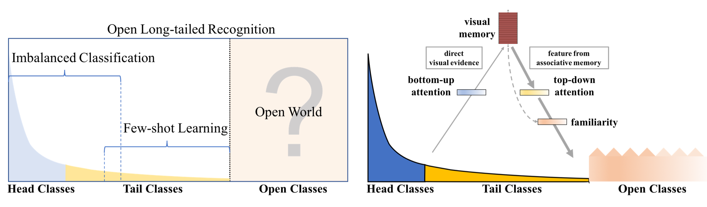
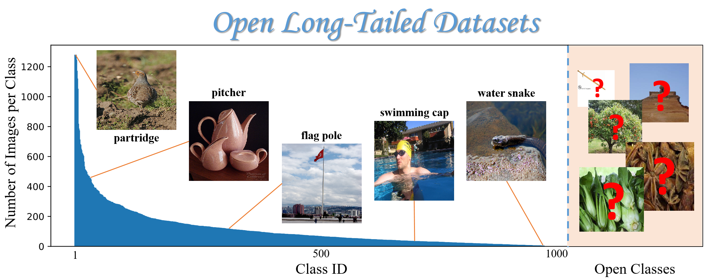
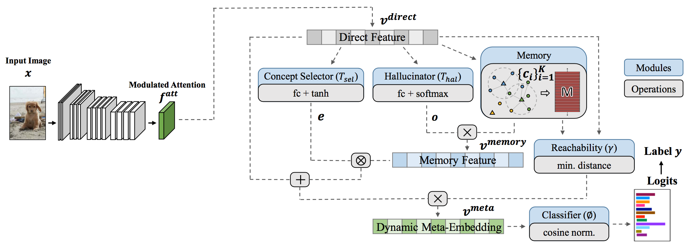

# Large-Scale Long-Tailed Recognition in an Open World

[[Project]](https://liuziwei7.github.io/projects/LongTail.html) [[Paper]](https://arxiv.org/abs/1904.05160) [[Blog]](https://bair.berkeley.edu/blog/2019/05/13/oltr/)

## Overview
`Open Long-Tailed Recognition (OLTR)` is the author's re-implementation of the long-tail recognizer described in:  
"[Large-Scale Long-Tailed Recognition in an Open World](https://arxiv.org/abs/1904.05160)"   
[Ziwei Liu](https://liuziwei7.github.io/)<sup>\*</sup>,&nbsp; [Zhongqi Miao](https://github.com/zhmiao)<sup>\*</sup>,&nbsp; [Xiaohang Zhan](https://xiaohangzhan.github.io/),&nbsp; [Jiayun Wang](http://pwang.pw/),&nbsp; [Boqing Gong](http://boqinggong.info/),&nbsp; [Stella X. Yu](https://www1.icsi.berkeley.edu/~stellayu/)&nbsp; (CUHK & UC Berkeley / ICSI)&nbsp; 
in IEEE Conference on Computer Vision and Pattern Recognition (CVPR) 2019, **Oral Presentation**



Further information please contact [Zhongqi Miao](mailto:zhongqi.miao@berkeley.edu) and [Ziwei Liu](https://liuziwei7.github.io/).

## Update notifications
* __03/04/2020:__ We changed all valirables named `selfatt` to `modulatedatt` so that the attention module can be properly trained in the second stage for Places-LT. ImageNet-LT does not have this problem since the weights are not freezed. We have updated new results using fixed code, which is still better than reported. The weights are also updated. Thanks!
* __02/11/2020:__ We updated configuration files for `Places_LT` dataset. The current results are a little bit higher than reported, even with updated F-measure calculation. One important thing to be considered is that we have unfrozon the model weights for the first stage training of `Places-LT`, which means it is not suitable for single-GPU training in most cases (we used 4 1080ti in our implementation). However, for the second stage, since the memory and center loss do not support multi-GPUs currently, please switch back to single-GPU training. Thank you very much!
* __01/29/2020:__ We updated the `False Positive` calculation in `util.py` so that the numbers are normal again. The reported F-measure numbers in the paper might be a little bit higher than actual numbers for all baselines. We will update it as soon as possible. We have updated the new F-measure number in the following table. Thanks.
* __12/19/2019:__ Updated modules with 'clone()' methods and set `use_fc` in ImageNet-LT stage-1 config to `False`. Currently, the results for ImageNet-LT is comparable to reported numbers in the paper (a little bit better), and the reproduced results are updated below. We also found the bug in Places-LT. We will update the code and reproduced results as soon as possible. 
* __08/05/2019:__ Fixed a bug in `utils.py`. Update re-implemented ImageNet-LT weights at the end of this page.
* __05/02/2019:__ Fixed a bug in `run_network.py` so the models train properly. Update configuration file for Imagenet-LT stage 1 training so that the results from the paper can be reproduced.  

## Requirements
* [PyTorch](https://pytorch.org/) (version >= 0.4.1)
* [scikit-learn](https://scikit-learn.org/stable/)

## Data Preparation



NOTE: Places-LT dataset have been updated since the first version. Please download again if you have the first version. 

- First, please download the [ImageNet_2014](http://image-net.org/index) and [Places_365](http://places2.csail.mit.edu/download.html) (256x256 version).
Please also change the `data_root` in `main.py` accordingly.

- Next, please download ImageNet-LT and Places-LT from [here](https://drive.google.com/drive/u/1/folders/1j7Nkfe6ZhzKFXePHdsseeeGI877Xu1yf). Please put the downloaded files into the `data` directory like this:
```
data
  |--ImageNet_LT
    |--ImageNet_LT_open
    |--ImageNet_LT_train.txt
    |--ImageNet_LT_test.txt
    |--ImageNet_LT_val.txt
    |--ImageNet_LT_open.txt
  |--Places_LT
    |--Places_LT_open
    |--Places_LT_train.txt
    |--Places_LT_test.txt
    |--Places_LT_val.txt
    |--Places_LT_open.txt
```

## Download Caffe Pre-trained Models for Places_LT Stage_1 Training
* Caffe pretrained ResNet152 weights can be downloaded from [here](https://drive.google.com/uc?export=download&id=0B7fNdx_jAqhtckNGQ2FLd25fa3c), and save the file to `./logs/caffe_resnet152.pth`

## Getting Started (Training & Testing)



### ImageNet-LT
- Stage 1 training:
```
python main.py --config ./config/ImageNet_LT/stage_1.py
```
- Stage 2 training:
```
python main.py --config ./config/ImageNet_LT/stage_2_meta_embedding.py
```
- Close-set testing:
```
python main.py --config ./config/ImageNet_LT/stage_2_meta_embedding.py --test
```
- Open-set testing (thresholding)
```
python main.py --config ./config/ImageNet_LT/stage_2_meta_embedding.py --test_open
```
- Test on stage 1 model
```
python main.py --config ./config/ImageNet_LT/stage_1.py --test
```

### Places-LT
- Stage 1 training (At this stage, multi-GPU might be necessary since we are finetuning a ResNet-152.):
```
python main.py --config ./config/Places_LT/stage_1.py
```
- Stage 2 training (At this stage, only single-GPU is supported, please switch back to single-GPU training.):
```
python main.py --config ./config/Places_LT/stage_2_meta_embedding.py
```
- Close-set testing:
```
python main.py --config ./config/Places_LT/stage_2_meta_embedding.py --test
```
- Open-set testing (thresholding)
```
python main.py --config ./config/Places_LT/stage_2_meta_embedding.py --test_open
```

## Reproduced Benchmarks and Model Zoo (Updated on 03/05/2020)

### ImageNet-LT Open-Set Setting

|   Backbone  |    Many-Shot   |  Medium-Shot  |   Few-Shot  |  F-Measure  |      Download      |
| :---------: | :------------: | :-----------: | :---------: | :---------: | :----------------: |
|  ResNet-10  |      44.2      |      35.2     |    17.5     |     44.6    |     [model](https://drive.google.com/open?id=1CKcZuTQJkRvA3pUK_AL_H2wsvt5gY5of)      |

### Places-LT Open-Set Setting

|   Backbone  |    Many-Shot   |  Medium-Shot  |   Few-Shot  |  F-Measure  |      Download      |
| :---------: | :------------: | :-----------: | :---------: | :---------: | :----------------: |
| ResNet-152  |      43.7      |      40.2     |    28.0     |     50.0    |     [model](https://drive.google.com/open?id=1ZkYzg74O8hKlsq8LcLlECsi2QVeG5mr0)      |

## CAUTION
The current code was prepared using single GPU. The use of multi-GPU can cause problems except for the first stage of `Places-LT`. 

## License and Citation
The use of this software is released under [BSD-3](https://github.com/zhmiao/OpenLongTailRecognition-OLTR/blob/master/LICENSE).
```
@inproceedings{openlongtailrecognition,
  title={Large-Scale Long-Tailed Recognition in an Open World},
  author={Liu, Ziwei and Miao, Zhongqi and Zhan, Xiaohang and Wang, Jiayun and Gong, Boqing and Yu, Stella X.},
  booktitle={IEEE Conference on Computer Vision and Pattern Recognition (CVPR)},
  year={2019}
}
```
