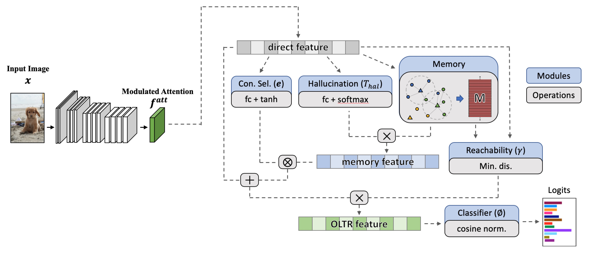

# Large-Scale Long-Tailed Recognition in an Open World

[[Project]](https://liuziwei7.github.io/projects/LongTail.html) [[Paper]]() [[Demo]]()      

## Overview
`Open Long-Tailed Recognition (OLTR)` is the author's re-implementation of the long-tail recognizer described in:  
"Large-Scale Long-Tailed Recognition in an Open World"   
[Ziwei Liu](https://liuziwei7.github.io/)<sup>\*</sup>, [Zhongqi Miao](https://github.com/zhmiao)<sup>\*</sup>, [Xiaohang Zhan](https://xiaohangzhan.github.io/), [Jiayun Wang](http://pwang.pw/), [Boqing Gong](http://boqinggong.info/), [Stella X. Yu](https://www1.icsi.berkeley.edu/~stellayu/) (CUHK & UC Berkeley / ICSI)
in IEEE Conference on Computer Vision and Pattern Recognition (CVPR) 2019, **Oral Presentation**


Further information please contact [Zhongqi Miao](zhongqi.miao@berkeley.edu) and [Ziwei Liu](https://liuziwei7.github.io/).

## Requirements
* [PyTorch](https://pytorch.org/) (version >= 0.4.1)
* [scikit-learn](https://scikit-learn.org/stable/)

## Data Preparation
- First, please download the [ImageNet_2014](http://image-net.org/index) and [Places_365](http://places2.csail.mit.edu/download.html) (256x256 version).
Please also change the `data_root` in `main.py` accordingly.

- Next, please download ImageNet-LT and Places-LT from [here](https://drive.google.com/drive/u/1/folders/1j7Nkfe6ZhzKFXePHdsseeeGI877Xu1yf). Please put the downloaded files into the `data` directory like this:
```
data
  |--ImageNet_LT
    |--ImageNet_LT_open
    |--ImageNet_LT_train.txt
    |--ImageNet_LT_test.txt
    |--ImageNet_LT_val.txt
    |--ImageNet_LT_open.txt
  |--Places_LT
    |--Places_LT_open
    |--Places_LT_train.txt
    |--Places_LT_test.txt
    |--Places_LT_val.txt
    |--Places_LT_open.txt
```

## Download Pre-trained Models
* Caffe pretrained ResNet152 weights can be downloaded from [here](https://drive.google.com/uc?export=download&id=0B7fNdx_jAqhtckNGQ2FLd25fa3c), and save the file to `.logs/caffe_resnet152.pth`

## Getting Started (Training & Testing)



### ImageNet-LT
- Stage 1 training:
```
python main.py --config ./config/ImageNet_LT/stage_1.py
```
- Stage 2 training:
```
python main.py --config ./config/ImageNet_LT/stage_2_meta_embedding.py
```
- Close-set testing:
```
python main.py --config ./config/ImageNet_LT/stage_2_meta_embedding.py --test
```
- Open-set testing (thresholding)
```
python main.py --config ./config/ImageNet_LT/stage_2_meta_embedding.py --test_open
```
- Test on stage 1 model
```
python main.py --config ./config/ImageNet_LT/stage_1.py --test
```

### Places-LT
- Stage 1 training:
```
python main.py --config ./config/Places_LT/stage_1.py
```
- Stage 2 training:
```
python main.py --config ./config/Places_LT/stage_2_meta_embedding.py
```
- Close-set testing:
```
python main.py --config ./config/Places_LT/stage_2_meta_embedding.py --test
```
- Open-set testing (thresholding)
```
python main.py --config ./config/Places_LT/stage_2_meta_embedding.py --test_open
```

## License and Citation
The use of this software is RESTRICTED to **non-commercial research and educational purposes**.
```
@inproceedings{openlongtailrecognition,
  title={Large-Scale Long-Tailed Recognition in an Open World},
  author={Ziwei Liu, Zhongqi Miao, Xiaohang Zhan, Jiayun Wang, Boqing Gong, Stella X. Yu},
  booktitle={IEEE Conference on Computer Vision and Pattern Recognition (CVPR)},
  year={2019}
}
```
